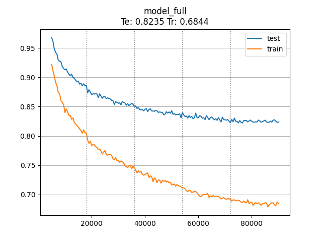

# TCGGPT

TCGGPT is a series of python scripts that can be used to train and run inference with a ~1-million parameter transformer-based model capable of generating the mechanically-relevant portions of Magic: The Gathering cards.

TCGGPT is built on MLX and will only run on Macs with an Apple Silicon processor.

This repo does not contain the model or training data, just the scripts needed to build and run the model. A full training run takes about 2 hours and 30 minutes on my M1 Pro MBP.

## Example Output

The character `|` represents a new line in the text box.

```
<Type> artifact
<ManaCost> {4}
<Text> {1} , {t} , sacrifice ~ : target attacking creature get - 4 / - 4 until end of turn .
```

```
<Type> instant
<ManaCost> {1} {u}
<Text> replicate {2} {u} | counter target spell unless its controller pays {1} . 
```

```
<Type> creature - - beast beast
<ManaCost> {4} {g}
<Stats> 3 / 3
<Text> {u} : ~ gains hexproof until end of turn .
```

It also frequently produces nonsense.
```
<Type> enchantment
<ManaCost> {2} {r}
<Text> whenever you cast a spell that targets a creature or that shares a creature type with at the end step , ~ deals 2 damage to any target .
```

## Running the Scripts

Before beginning, you will need the raw data to train the network. You can download a json file in the appropriate format from [Scryfall's Bulk Data page](https://scryfall.com/docs/api/bulk-data). The best set for training is 'Oracle Cards' because it is de-duplicated by card name.

For this section, I will assume you have downloaded the oracle json file and placed it on the path `./data/raw/oracle-cards.json`.

1. Create a new virtualenv and install the python dependencies.
    * `pip install -r ./requirements.txt`
2. Run the preprocess script to extract the data from the oracle json file. This will produce a few files in `./data/`.
    * `python ./0_preprocess.py ./data/raw/oracle-cards.json`
3. Run the training script to train the network with default configuration. This will produce a model file at `./model/model.safetensors` and a tokenizer definition at `./model/model.tokenizer`. It will also write some details about the training run to `./train_log/default/`.
    * `python ./1_train_model.py`
4. Run the inference script to generate any number of cards. Cards are delimited by the string `<NewCard>`.
    * `python ./2_inference.py ./model/model.safetensors --count 5`
    * This will automatically locate the tokenizer definition by replacing `.safetensors` with `.tokenizer` in the model path.
    * Run `python ./2_inference.py --help` to see available inference options.

## Architecture

The architecture of this model is largely a copy of Andrej Karpathy's [nanoGPT](https://github.com/karpathy/nanoGPT), which itself it based on GPT-2, with some minor modifications and re-tuned hyperparameters. It has also been extended to support some more modern features including SwiGLU feed-forward blocks and RoPE.

Because this is a very small model at around 1 million paramaters, it has no chance of being trained as a general purpose language model capable of outputting coherent natural language. Instead, it is designed around the fact that Magic: The Gathering cards are written in a very strict subset of English with many common words and phrases being repeated on thousands of different cards.

This model is broadly capable of outputting cards that make sense with respect to:
* Effects cards can have
* How multiple effects can be composed into one card
* Permanents having static/triggered/activatable effects and instants/sorceries having immediate effects.
* Which effects correlate with which card types and mana types (blue for card draw, red for direct damage, etc).

It struggles to ensure that a card's 'strength' is proportional to its mana cost.

### Tokenization

This model uses whole-word tokenization because we only want it to output words that are found in the training data set and it does not need to understand unseen words as input. Tokenization is case-insensitive.

### Input Data

To facilitate letting the model learn all of the above information, we want to make sure we feed it only data that is directly relevant to how a card functions in the game. For now, this means that we only care about:
* Type line
* Mana cost
* Rules text
* Stats (creatures only)

Things like card name and flavor text do not follow MTG's strict templating rules and use unique words and phrases that are rarely repeated in the training data, so the model will only be made less effective by their presence.

#### Cleaning the Data

The raw data from scryfall is cleaned in a way to help the model learn meaningful associations between different tokens. This is accomplished by replacing rare tokens with more generic tokens as described below, as well as decomposing nouns and verbs.

1. Anywhere a card references itself in rules text, its name is replaced by `~`.
2. Anywhere a card references another card by name, the name is replaced by `$named_card$`.
3. Flavor ability words are replaced by `$flavor_ability_word$`.
4. Counters, tokens, and Planeswalker types that appear on only one card are replaced with `$unique_counter$`, `$unique_token$`, and `$unique_planeswalker$`.
5. Some plural words are decomposed into the singular version of the word followed by `~s`. (ex: `creatures` -> `creature ~s`)
6. Some verbs are decomposed into a base verb followed by a suffix. (ex: `draws` -> `draw ~s`)

## Training Loss

A graph of the training loss across train and test sets when trained on the scryfall oracle dump from July 3, 2024:

